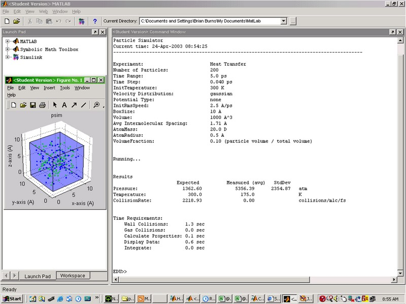

# psim (Particle Simulator)

psim is a particle simulator that puts a number of particles in a box and measures various thermodynamic properties, and compares them with expected values. 

psim can run different experiments - Velocity Distribution, Ideal Gas Law, Real Gas, Heat Flow, and Diffusion, and could be extended with many other experiments - Brownian Motion, Osmosis, Membrane Potential, Speed of Sound, Heat Capacities, Enthalpy, Entropy, Free Energy, Water, Liquid-Gas Equilibrium, and the Joule-Thompson Effect. 

psim is written in MatLab. 


## Setup




## Report

The final report is available [here](report/Report.pdf).


## Experimental Logs

Logs of all experimental runs were automatically kept, e.g. 


### Velocity Distribution

```
------------------------------------------------------------------------------------------
psim, version 4/23/2003
Particle Simulator
Current time: 24-Apr-2003 11:21:39
------------------------------------------------------------------------------------------

Experiment:                        Maxwell Velocity Distribution
Number of Particles:               100
Time Range:                        10.0 ps
Time Step:                         0.100 ps
InitTemperature:                   100 K
Velocity Distribution:             same 
Potential Type:                    none 
InitRmsSpeed:                      3.5 A/ps
BoxSize:                           10 x 10 x 10 A
Volume:                            1000 A^3
Avg Intermolecular Spacing:        2.15 A
AtomMass:                          20.0 D
AtomRadius:                        0.5 A
VolumeFraction:                    0.05 (particle volume / total volume)
MassDensity:                       3321.08 kg/m^3

Running...

Results
                       Expected          Measured (avg)   StdDev            
Pressure:                1362.60            1410.88       507.34   atm               
Temperature:               100.0              100.0                K                 
CollisionRate:           1569.02            1715.00                collisions/mlc/fs 

Time Requirements:
    Wall Collisions:      0.5 sec
    Gas Collisions:       13.3 sec
    Calculate Properties: 0.0 sec
    Display Data:         0.7 sec
    Integrate:            0.0 sec

Need to reduce time step! currently 0.100 ps, should be 0.059 ps

```


## License

GPL
